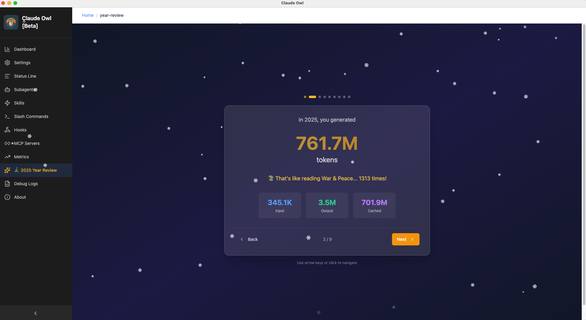

# Claude Owl 🦉

> A beautiful, open-source desktop UI for managing Claude Code configurations, settings, and features.

[](https://opensource.org/licenses/MIT)
[](https://nodejs.org/)
[](CONTRIBUTING.md)
[](#status)

**Status:** 🚀 Beta - Actively developed, currently supports **macOS and Windows**.

---

## What is Claude Owl?

Claude Owl is a desktop application for managing [Claude Code](https://code.claude.com) configurations through an intuitive visual interface. Instead of manually editing JSON and YAML configuration files in your text editor or through the Claude Code CLI.

## Current Features (Beta)

For a complete list of features, see [SCREENSHOTS.md](SCREENSHOTS.md) and [CHANGELOG.md](CHANGELOG.md).


### 🎄 2025 Year in Review

Celebrate your year of AI-powered development! Claude Owl now includes a festive Year in Review feature that showcases your 2025 coding journey with Claude Code:

- **📊 Beautiful Stats**: Token usage, costs, sessions, and activity patterns
- **🏆 Achievement Badges**: Earn badges for milestones and coding habits
- **🎯 Model Insights**: See your favorite Claude models and usage breakdown
- **📈 Activity Analytics**: Peak coding months, longest streaks, and daily patterns
- **🎁 Social Sharing**: Share your year with customizable stats for Twitter/X



Available now through January 1, 2026!

## Installation

### Prerequisites

- **Node.js** >= 18.0.0
- **npm** >= 9.0.0
- **Claude Code CLI** ([installation guide](https://code.claude.com/docs/en/quickstart))
- **macOS or Windows**

### Install from Source

Claude Owl is currently in Beta and available for development/testing:

```bash
# Clone the repository
git clone https://github.com/antonbelev/claude-owl.git
cd claude-owl

# Install dependencies
npm install

# Run in development mode
npm run dev:electron
```

### Download Pre-built Binaries

Pre-built installers are available for macOS and Windows:

**[📥 Download Latest Release](https://github.com/antonbelev/claude-owl/releases/latest)**

- **macOS**: `.dmg` files for Intel and Apple Silicon
- **Windows**: `.exe` installer for x64 and ARM64

For detailed installation instructions, see our [Installation Guide](https://antonbelev.github.io/claude-owl/installation.html).

### Build from Source

```bash
npm run build
npm run package
```

## Documentation

- [Architecture Overview](docs/architecture.md) - System design and technical details
- [Contributing Guide](CONTRIBUTING.md) - How to contribute
- [Code of Conduct](CODE_OF_CONDUCT.md) - Community guidelines
- [Development Notes](CLAUDE.md) - Development commands and project structure
- [CHANGELOG.md](CHANGELOG.md) - List of changes and updates

## Tech Stack

- **Desktop Framework**: Electron
- **Frontend**: React 18 + TypeScript
- **Build Tool**: Vite
- **State Management**: Zustand
- **Styling**: Tailwind CSS + shadcn/ui
- **Testing**: Vitest + React Testing Library

## Contributing

We welcome contributions! See [CONTRIBUTING.md](CONTRIBUTING.md) for guidelines.

To get started:

```bash
# Fork and clone the repository
git clone https://github.com/antonbelev/claude-owl.git
cd claude-owl

# Install dependencies
npm install

# Start development server
npm run dev:electron
```

## FAQ

### Does Claude Owl replace Claude Code?

No, Claude Owl is a UI companion for Claude Code. It manages configurations visually but still uses the Claude Code CLI under the hood.

### Is my data safe?

Yes! Claude Owl is completely local-first. All configurations and data stay on your machine. No data is sent to external servers, and no telemetry is collected.

### What platforms are currently supported?

- **macOS** (Intel & Apple Silicon) - ✅ Fully supported
- **Windows** (x64 & ARM64) - ✅ Fully supported

### How can I contribute?

See [CONTRIBUTING.md](CONTRIBUTING.md) for contribution guidelines.

## License

Claude Owl is open-source software licensed under the [MIT License](LICENSE).

## Support

- 📖 [Documentation](docs/)
- 💬 [Discussions](https://github.com/antonbelev/claude-owl/discussions)
- 🐛 [Issue Tracker](https://github.com/antonbelev/claude-owl/issues)

## Disclaimer

Claude Owl is an independent community project and is **not affiliated with, endorsed by, or sponsored by Anthropic**. Claude is a trademark of Anthropic, Inc. This project uses Claude through the publicly available Claude Code CLI and is not an official Anthropic product.

---
